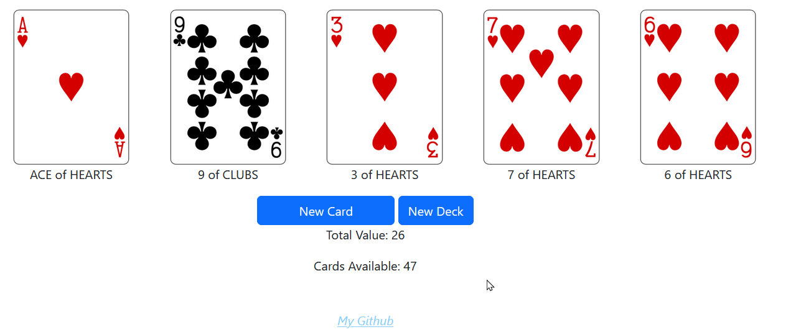

# CardPull

Card Pull is an app I created using the [DeckOfCards API](https://deckofcardsapi.com/). 
It creates a deck of cards and pulls five at a time from the deck.

You can try it live [here](https://cardpull.cyclic.app)
